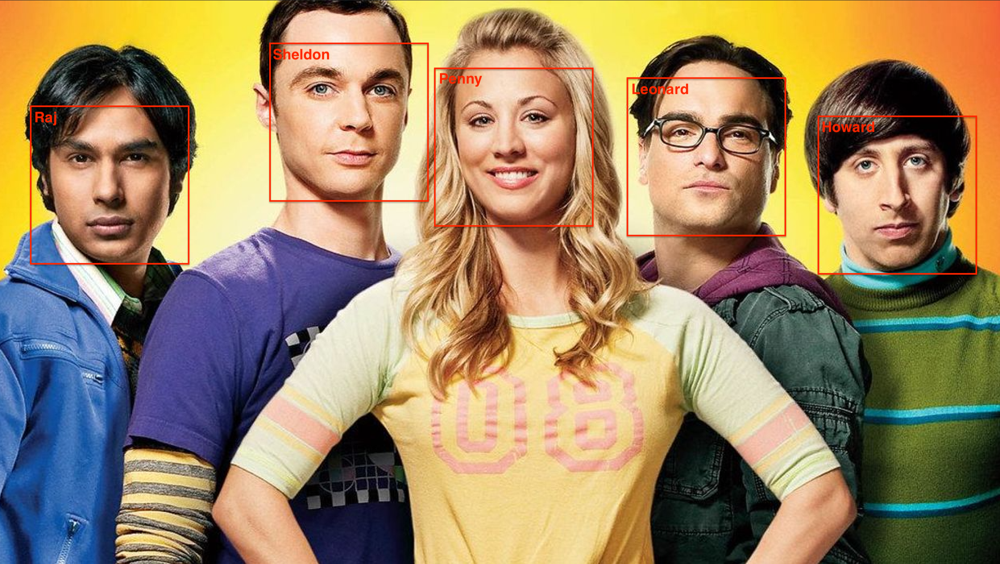
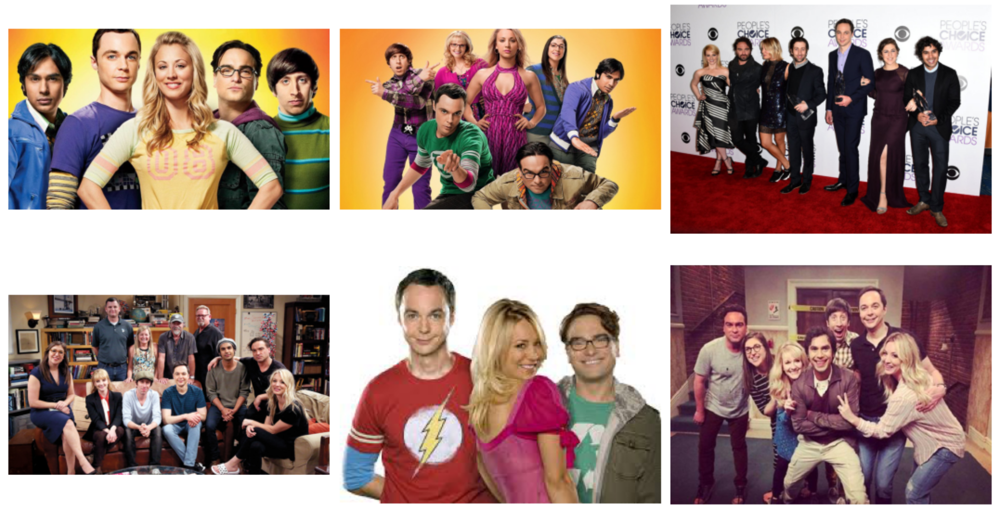
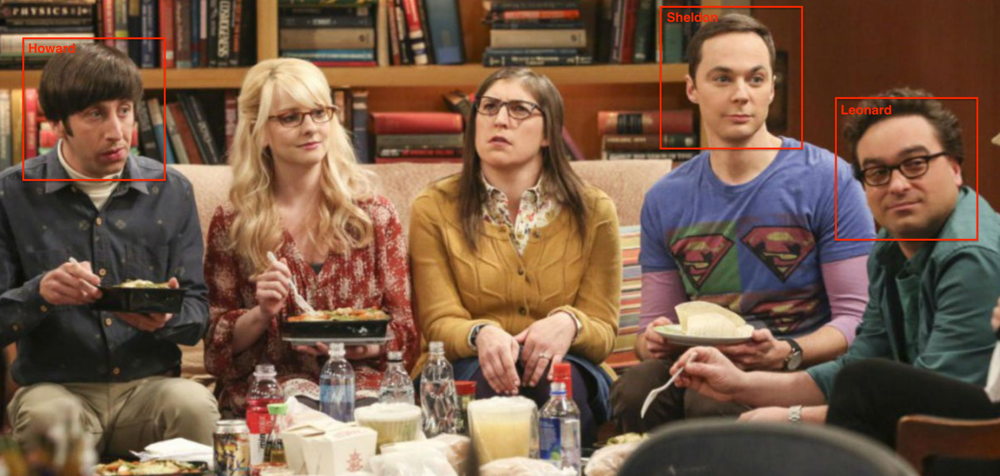
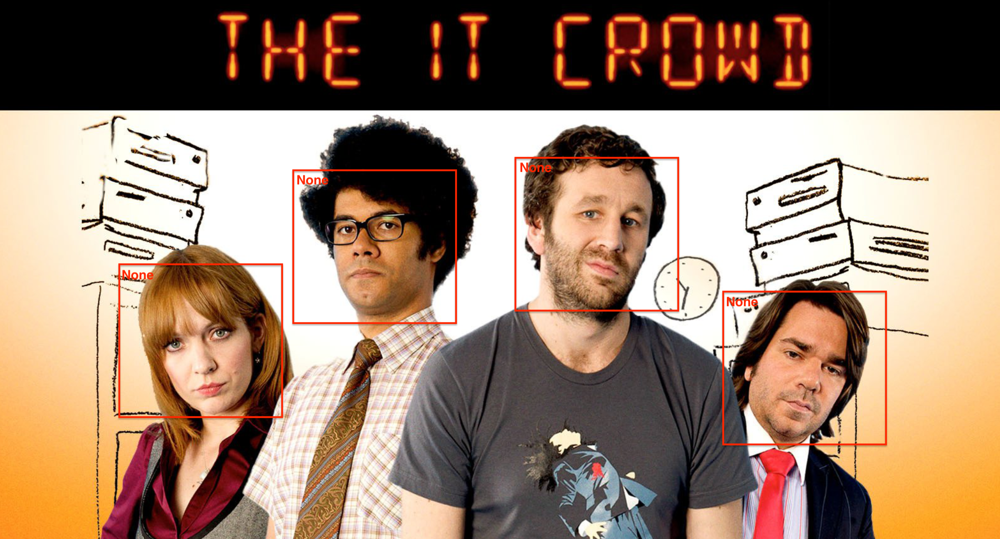

# Few-Shot Face Classification

Library to recognise and classify faces.

## Installation

To install this package in your environment, run:

```bash
pip install git+https://github.com/RubenPants/few-shot-face-classification.git
```




## Usage

This library aims to solve the following problem: 
> I have a folder full of images and would like to extract only those in which certain people of interest occur

This is done by using face extraction together with face recognition, in order to derive which faces look similar enough to deem a high plausibility of being of interest to the user.

More concrete, the main goal of this library is to prune out most images that don't include people of interest, while ensuring that almost all images of interest are successfully extracted. 
In other words, we want to make sure all potential interesting images are indeed extracted, at the cost of some extra / irrelevant images that are extracted. This helps to narrow down the search drastically (assuming a lot of different people occur in the images) when searching for certain people.


### 0. Data preparation

The package operates on three different folders that contain images:
- A *raw data* folder, which carries a raw dump of the images to analyse/classify
- A *labeled* folder, which carries all labeled information
- A *write* folder, which will carry the results of the algorithm

For the time being, only images in the `.png`, `.jpg`, and `.jpeg` format are supported. All files present in the folders that have another format will be ignored.

#### 0.1. Raw data folder

This data folder, usually named by `raw_f` in the code, consists of images that are to be classified. 
This can be a raw dump, as its name suggests.
In these images, several faces (or even zero) can be present.

Note that the labeled folder cannot be the same folder as the raw data folder.

#### 0.2. Labeled folder

This data folder, usually named by `labeled_f` in the code, consists of pictures in which only a single face is present.
This face can either be of a *person of interest* or of a *person **not** of interest*.
The names of these image-files denote to which class the image belongs:
- An image consisting of a person of interest has the name `<name>_<some-text>.<format>` where `<name>` denotes the class-name, `<some-text>` denotes any text of your choice (e.g. a number) and `<format>` denotes one of the supported image formats, as mentioned above. For example, if I want to add an image of *Sheldon*, I crop a picture of his face and name it `sheldon_1.png`.
- An image consisting of a person not or interest has a fixed class-name `none`. These images can be used to prevent the algorithm from mis-classifying similar faces. Say for example, someone looks similar to a person of interest, which causes a lot of *false positives*, then an image of this person's face with a name as `none_1.png` would prevent the algorithm from misclassifying.

Note that the labeled folder cannot be the same folder as the raw data folder.

#### 0.3. Write folder

This data folder, usually named by `write_f` in the code, carries the results of the algorithm, which are written as subfolders within this folder.
All images that match a person of interest *person* are written to the folder `write_f/person/`.
This folder can be the same as the `raw_f` or `labeled_f` folders.


### 1. Detect and export

This core function of this package, `detect_and_export(raw_f, labeled_f, write_f)`, is used to categorise all the images found under `raw_f` to each person of interest. Note, this means that some images can be exported to several persons of interest at the same time, leading to several duplicate images across the category subfolders (under `write_f`).

The algorithm will memorise all the faces it finds in the `labeled_f` folder and assign these *face representations* (or more generally called *embeddings*) to each of the mentioned categories (persons of interest). Using these captured face representations, it will then go over all images found in the `raw_f` folder to check for each image if a matching face is found. If the latter is the case, then this image will be exported to the correct subfolder, stored under `write_f`.

**Note: If one or more people of interest are ignored during the export, this may be due to some bad representations in the `labeled_f` folder. To ensure everybody is extracted successfully, it's a good idea to add several representations of a single person in the `labeled_f` folder.**

```python
from pathlib import Path
from few_shot_face_classification import detect_and_export

detect_and_export(
    raw_f=Path.cwd() / 'path-to-raw-folder',
    labeled_f=Path.cwd() / 'path-to-labeled-folder',
    write_f=Path.cwd() / 'path-to-write-folder',
)
```

For example, you can use it to export all pictures in which Sheldon is present:



### 2. Recognise

Another function of the package, `recognise(path, labeled_f)`, is used to recognise all *persons of interest* present in a single image. Similar to the previous function, the algorithm will memorise all the faces it has seen in the `labeled_f` folder. Using these face representations, it then goes over each face that is detected on the provided image (note: image-path is provided, which then refers to the image itself) to see if which persons of interest are indeed present. The output of this function is a set denoting all persons of interest present.

**Note: In the example below, Amy and Bernadette are not of interest.**

```python
from pathlib import Path
from src.few_shot_face_classification import recognise

set_of_classes = recognise(
    path=Path.cwd() / 'path-to-image.png',
    labeled_f=Path.cwd() / 'path-to-labeled-folder',
)
```

For example, you can use it to recognise Howard, Sheldon, and Leonard in the image below:



### 3. Reducing false positives

Sometimes, several images are included of people **not** of interest. It is possible to remove these false positives from the export by adding faces to the labeled dataset which the algorithm has to ignore. If you have several images of people (can be several people in one single image) that should not get recognised, you can add them as qualified "noise" to the labeled folder (`labeled_f`) to reduce the number of false positives made by the algorithm.

The algorithm will extract the faces present in the provided image, and assign them all to the `None` class. Newly observed faces (during inference) that match with any face from this none-class are ignored automatically. In other words, the algorithm keeps operating as it did before. However, if the *best face-match* happens to be with a face from this none-class, the algorithm identifies this match as *not of interest* and ignores it. However, if another face in the image still matches one of the people of interest, this match still proceeds.

**Note: running the same image twice will cause duplicates. This shouldn't affect the algorithm too much, however it can slow down inference time when done too much.**

```python
from pathlib import Path
from few_shot_face_classification import add_none

add_none(
    path=Path.cwd() / 'path-to-image.png',
    labeled_f=Path.cwd() / 'path-to-labeled-folder',
)
```

For example, you can use it to specify which faces to ignore:



## Jupyter Notebook

For more information on the package and its functions, please refer to the guiding Jupyter Notebook. 
This notebook can be found under the `demo/` repository, together with all the supporting data.


## Future improvements

### Unsupervised clustering

Perform an unsupervised clustering over all faces recognised in the raw data folder. 
This would distribute (or copy) the images in the raw data folder to various folders representing each person occurring in the data.
Through density based clustering algorithms (e.g. `HDBSCAN`), it is possible to remove people that don't occur too often in the data, only keeping those that are regularly in the frame (and are likely of interest to us).


### Labeling framework

An improvement in terms of *user-friendliness* would be to create a tool to label faces more efficiently.
This tool could be self-learning, which implies that it only asks to label those samples for which the algorithm is most uncertain about.
